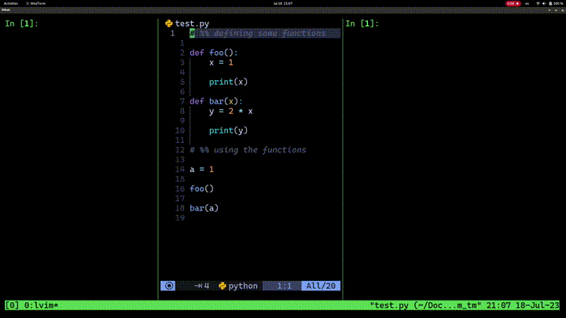

# tunnell.nvim

A [neovim](https://neovim.io/) plugin to ~send~ tunnell your selections and cells to targets, written in [Lua](https://www.lua.org/).

## Usage



- `:TunnellSelection` to tunnell the active selection
- `:TunnellCell` to tunnell the cell where the cursor is. Note that the cursor doesn't need to be on the header of the cell, but anywhere inside it
- Navigate to the next or previous cell with `n` and `N`
- `:TunnellConfig` to change the default cell header (`# %%`) or the default target (`{right-of}`)

## Installation

The plugin is simple and easy to install. Just add "sourproton/tunnell.nvim" to your plugin manager and call `setup()`:

```lua
-- using lazy.nvim plugin manager

require("lazy").setup({
    -- ...

    {
        "sourproton/tunnell.nvim",
        config = function()
            require("tunnell.nvim").setup({
                -- the default options are:
                -- tmux_target = "{right-of}",
                -- cell_header = "# %%",
                -- use_default_keymaps = true,
            })
        end
    }

    -- ...
})
```

If `use_default_keymaps` is `true`, then `<leader>t` is mapped to `:<C-U>TunnellSelection<CR>` in visual mode and to `:TunnelCell<CR>` when in normal mode.

## About

I made this plugin to learn Lua and how to make a neovim plugin. I work a lot with REPL-based workflows and tunnelling is something that makes my life a lot easier.

Yes, this plugin does what [vim-slime](https://github.com/jpalardy/vim-slime) does but has a lot less functionality. You should definitely go with vim-slime.

For now, only tmux targets are supported, but making zellij, kitty, wezterm and other targets should not be hard. I just lack the motivation to do it because I personally use tmux.
